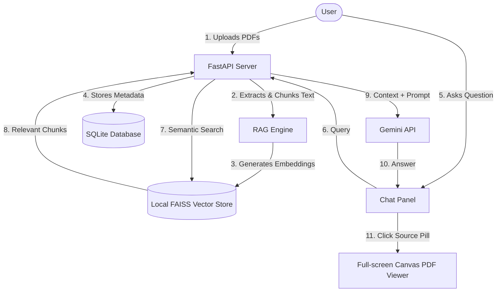

LIVE ON - https://docintel-production-a44e.up.railway.app/

# 📑 DocIntel — Enterprise AI Document Intelligence System

DocIntel is a premium, high-performance RAG (Retrieval-Augmented Generation) application designed for enterprise document search and chat intelligence. It allows users to upload multiple PDF documents, indices them locally using **FAISS vector embeddings**, and provides semantic chat capabilities with source context highlighting directly on a PDF canvas.

The application features a modern, responsive layout optimized for desktop and mobile devices.

---

## 🚀 Key Features

*   **📤 Multi-PDF Upload & Processing**: Seamlessly upload multiple PDF files. Documents are automatically parsed, split into text chunks, and stored with their metadata.
*   **🧠 Contextual Chat Memory**: Interactive chat interface that retains context from recent exchanges to support natural follow-up questions.
*   **🎯 Source Attribution & Canvas Highlighting**: AI answers cite the exact source text. Clicking on a citation pill opens the integrated PDF viewer, scrolls to the match location, and draws a visual highlight overlay on the page canvas.
*   **📱 Mobile-Optimized Responsive UX**: 
    *   **Hamburger Sidebar Drawer**: Converts the dashboard sidebar into a sliding off-canvas drawer on mobile screens with a background backdrop.
    *   **Full-Screen PDF Viewer Overlay**: Displays PDF pages in full screen on mobile devices instead of cramming them side-by-side, ensuring document readability.
    *   **Click-Away Dismissal**: Close the drawer effortlessly by tapping anywhere outside or on the backdrop.
*   **🔒 Secure Local Storage**: Uses SQLite for user/session management and FAISS indexes for lightning-fast similarity search.

---

## 🛠️ Architecture Flow



---

## 📂 Project Structure

```text
c:/RAG project/
├── auth.py              # JWT authentication & password hashing
├── database.py          # SQLAlchemy connection & database initialization
├── main.py              # FastAPI application & REST API routes
├── models.py            # SQLite schema models (User, ChatMessage, Document)
├── rag_engine.py        # text chunking, FAISS index management, Gemini query
├── requirements.txt     # Python dependencies
├── static/              # Frontend Assets
│   ├── css/
│   │   └── styles.css   # Main stylesheet (including glassmorphism & responsive drawer styles)
│   ├── js/
│   │   ├── app.js       # App controller (auth state, uploads, chat, mobile toggle events)
│   │   └── pdf-viewer.js# Dynamic PDF renderer & canvas highlighting overlay
│   └── index.html       # Landing and Dashboard HTML layouts
```

---

## ⚙️ Installation & Setup

### Prerequisites
- Python 3.9+
- Gemini API Key

### 1. Clone & Set Environment Variables
Create a `.env` file in the root directory:
```env
GEMINI_API_KEY=your_gemini_api_key_here
JWT_SECRET=your_jwt_signing_secret_here
DATABASE_URL=sqlite:///./rag_app.db
```

### 2. Install Dependencies
```bash
pip install -r requirements.txt
```

### 3. Run the Server
```bash
python main.py
```
Open [http://localhost:8000/](http://localhost:8000/) in your browser.

---

## 🧪 Tech Stack
- **Backend**: FastAPI, Uvicorn, SQLAlchemy (SQLite)
- **RAG / AI**: Google Generative AI (Gemini), SentenceTransformers, FAISS
- **Frontend**: Native HTML5, CSS3 Custom Properties (custom responsive layouts), Vanilla JavaScript (PDF.js from CDN)
