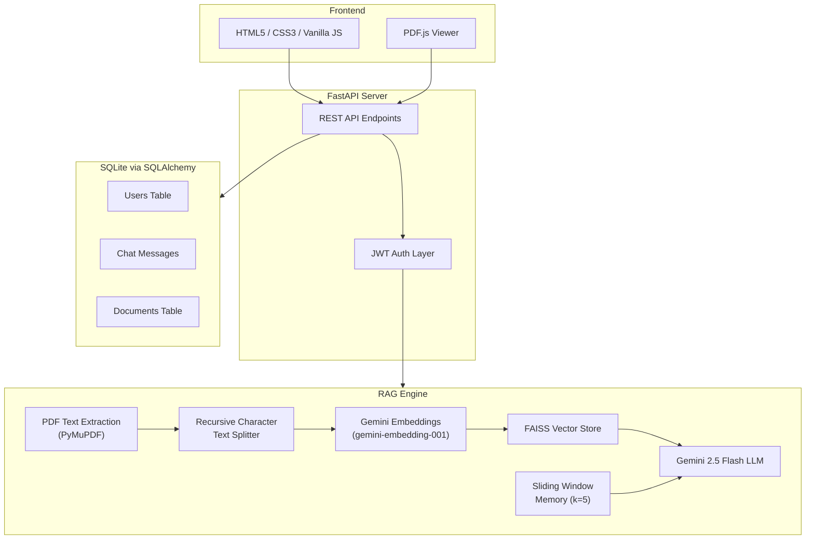

# DocIntel — Technology, Tools & Algorithms Report

Complete breakdown of every technology used in your **AI Document Intelligence** (RAG) system.

---

## 🏗️ Architecture Overview



---

## 1. Backend Framework & Server

| Technology | Role | Details |
|:--|:--|:--|
| **FastAPI** | Web framework | Async Python web framework for building REST APIs with automatic OpenAPI docs |
| **Uvicorn** | ASGI server | Lightning-fast ASGI server running the FastAPI app (`uvicorn[standard]`) |
| **Pydantic** | Data validation | Request/response schema validation (`BaseModel`, `EmailStr`) |
| **python-multipart** | File uploads | Enables `multipart/form-data` parsing for PDF file uploads |
| **CORS Middleware** | Cross-origin support | Allows frontend requests from any origin |

### Key Endpoints
- `POST /api/register` — User registration
- `POST /api/login` — User login
- `POST /api/upload` — Multi-PDF upload & processing
- `POST /api/chat` — Memory-aware RAG query
- `GET /api/documents` — List user documents
- `GET /api/pdf/{filename}` — Serve PDF for viewer
- `DELETE /api/chat/clear` — Clear chat history

---

## 2. AI / Machine Learning Stack

### 2.1 LLM (Large Language Model)

| Component | Value |
|:--|:--|
| **Model** | `gemini-2.5-flash` |
| **Provider** | Google Generative AI |
| **Library** | `langchain-google-genai` → `ChatGoogleGenerativeAI` |
| **Temperature** | `0.2` (deterministic, factual responses) |
| **Prompting** | Custom system prompt via `ChatPromptTemplate` — instructs the model to answer *only* from provided document context with source attribution |

### 2.2 Embedding Model

| Component | Value |
|:--|:--|
| **Model** | `models/gemini-embedding-001` |
| **Provider** | Google Generative AI |
| **Library** | `langchain-google-genai` → `GoogleGenerativeAIEmbeddings` |
| **Purpose** | Converts text chunks into dense vector representations for similarity search |

### 2.3 LangChain Orchestration

| Package | Usage |
|:--|:--|
| `langchain` | Core framework for chaining LLM operations |
| `langchain-google-genai` | Google Gemini LLM + Embeddings integration |
| `langchain-community` | FAISS vector store wrapper |
| `langchain-text-splitters` | `RecursiveCharacterTextSplitter` for chunking |
| `langchain-core` | `ChatPromptTemplate`, `Document` primitives |

---

## 3. Algorithms & Techniques

### 3.1 RAG (Retrieval-Augmented Generation)

The core algorithm powering the system:

```
User Query → Embed Query → Similarity Search (FAISS) → Retrieve Top-K Chunks → Inject into Prompt → LLM Generates Answer
```

> [!IMPORTANT]
> This is **not** a fine-tuned model. The LLM answers are grounded entirely in the retrieved document chunks, reducing hallucination.

### 3.2 Recursive Character Text Splitting

| Parameter | Value | Purpose |
|:--|:--|:--|
| `chunk_size` | **500 characters** | Maximum size of each text chunk |
| `chunk_overlap` | **100 characters** | Overlap between consecutive chunks to preserve context at boundaries |
| `length_function` | `len` | Character-level length measurement |

**How it works:** Recursively splits text using a hierarchy of separators (`\n\n` → `\n` → ` ` → `""`) to keep semantically coherent paragraphs/sentences together.

### 3.3 Similarity Search (Approximate Nearest Neighbors)

| Component | Details |
|:--|:--|
| **Algorithm** | FAISS (Facebook AI Similarity Search) — uses **L2 distance** (Euclidean) by default |
| **Top-K** | `k=4` — retrieves the 4 most similar chunks per query |
| **Index Type** | `IndexFlatL2` (exact search, no approximation) via LangChain default |

### 3.4 Conversational Memory (Sliding Window)

| Parameter | Value |
|:--|:--|
| **Strategy** | Sliding window — last **k=5** exchanges |
| **Storage** | Persisted in SQLite `chat_messages` table |
| **Injection** | Prepended to the LLM prompt as `"─── Recent Conversation ───"` |

The system fetches the last 10 messages from DB, reverses to chronological order, then the RAG engine trims to the last 5 exchanges for context window efficiency.

### 3.5 Multi-Document Index Merging

When new PDFs are uploaded, they are **merged** into the user's existing FAISS index rather than replacing it. This allows incremental knowledge base growth:

```python
existing_db.merge_from(new_db)  # Union of both indexes
```

---

## 4. Vector Database

| Component | Details |
|:--|:--|
| **FAISS** (`faiss-cpu`) | Facebook's library for efficient similarity search |
| **Storage** | Local disk persistence at `faiss_stores/user_{id}/` |
| **Isolation** | Per-user indexes — each user has their own vector store |
| **Serialization** | LangChain's `save_local()` / `load_local()` with `allow_dangerous_deserialization=True` |

---

## 5. PDF Processing

| Tool | Role |
|:--|:--|
| **PyMuPDF** (`fitz`) | High-performance PDF text extraction engine |
| **Method** | `page.get_text()` — extracts raw text from each page sequentially |
| **Validation** | Raises error on empty/scanned PDFs without OCR |

---

## 6. Authentication & Security

| Technology | Role | Details |
|:--|:--|:--|
| **JWT (JSON Web Tokens)** | Token-based auth | `python-jose[cryptography]` with **HS256** algorithm |
| **bcrypt** | Password hashing | Via `bcrypt` library — salted hashing with `bcrypt.gensalt()` |
| **HTTPBearer** | Token extraction | FastAPI security dependency for `Authorization: Bearer <token>` headers |
| **Token Expiry** | Session management | 24-hour token lifetime |

### Auth Flow
```
Register/Login → Server returns JWT → Client stores in localStorage → Sent as Bearer token on every API request → Server validates & extracts user_id
```

---

## 7. Database (Relational)

| Component | Details |
|:--|:--|
| **SQLite** | Lightweight file-based database (`rag_app.db`) |
| **SQLAlchemy** | ORM for Python — declarative models with `Base` |
| **Session Management** | Dependency injection via FastAPI's `Depends(get_db)` |

### Schema

| Table | Columns | Purpose |
|:--|:--|:--|
| `users` | id, email, password_hash, created_at | User accounts |
| `chat_messages` | id, user_id, role, content, created_at | Conversation history (memory) |
| `documents` | id, user_id, filename, uploaded_at | Uploaded PDF tracking |

---

## 8. Frontend

| Technology | Role |
|:--|:--|
| **HTML5** | Page structure — single-page application |
| **Vanilla CSS** | Styling with Inter font (Google Fonts), glassmorphism design |
| **Vanilla JavaScript** | All client-side logic in `app.js` |
| **PDF.js** (Mozilla) | In-browser PDF rendering from CDN (`v4.4.168`) |
| **SVG Icons** | Inline SVG icons (no icon library dependency) |

### Frontend Features
- Auth overlay (login/register forms)
- Drag & drop PDF upload zone
- Real-time chat interface with AI/user message bubbles
- Sidebar with document list
- Integrated PDF viewer panel
- Source attribution display in chat responses

---

## 9. Infrastructure & DevOps

| Tool | Role |
|:--|:--|
| **python-dotenv** | Environment variable management (`.env` file) |
| **RotatingFileHandler** | Log rotation — 5MB max, 3 backups → `logs/app.log` |
| **Centralized Logger** | Custom `get_logger()` factory with file + console output |

### Environment Variables
| Variable | Purpose |
|:--|:--|
| `GEMINI_API_KEY` | Google Generative AI API key |
| `GOOGLE_API_KEY` | Alias for Gemini API key |
| `JWT_SECRET_KEY` | Secret for signing JWT tokens |

---

## 10. Complete Dependency List

From [requirements.txt](file:///c:/RAG%20project/requirements.txt):

| Package | Category |
|:--|:--|
| `fastapi` | Web Framework |
| `uvicorn[standard]` | ASGI Server |
| `python-multipart` | File Upload Parsing |
| `pymupdf` | PDF Text Extraction |
| `langchain` | LLM Orchestration |
| `langchain-google-genai` | Gemini LLM + Embeddings |
| `langchain-community` | FAISS Integration |
| `langchain-text-splitters` | Text Chunking |
| `faiss-cpu` | Vector Similarity Search |
| `python-dotenv` | Env Config |
| `python-jose[cryptography]` | JWT Authentication |
| `passlib[bcrypt]` | Password Hashing |
| `sqlalchemy` | Database ORM |

---

## 📊 Summary Stats

| Metric | Value |
|:--|:--|
| **Total Python files** | 6 |
| **Total JS files** | 2 |
| **Backend LOC** | ~600 |
| **Frontend LOC** | ~150 (HTML) + CSS + JS |
| **API Endpoints** | 7 |
| **Database Tables** | 3 |
| **LLM Model** | Gemini 2.5 Flash |
| **Embedding Model** | Gemini Embedding 001 |
| **Vector DB** | FAISS (L2 flat index) |
| **Auth Method** | JWT + bcrypt |
